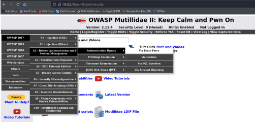
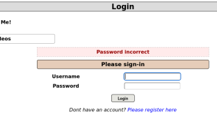
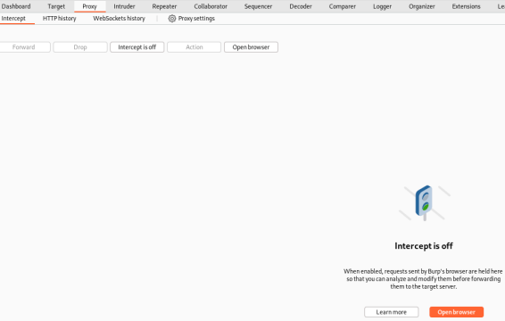
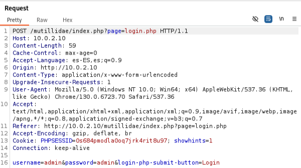
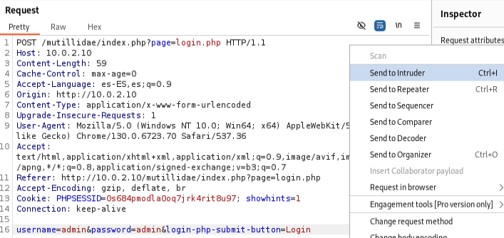
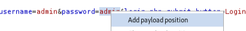
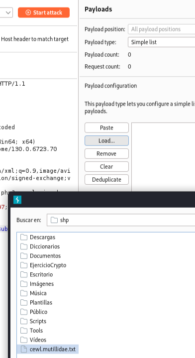
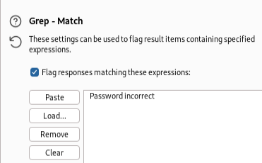
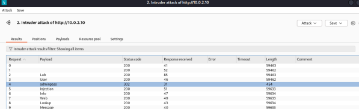
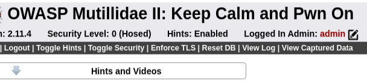

<h2>Ejercicio Burpsuite</h2>

Primero, abrimos la aplicación **BurpSuite** y nos aseguramos de que esté completamente cargada.

En la pestaña **Proxy** de **BurpSuite**, seleccionamos el botón "**Open Browser**", lo que abre un navegador donde introducimos el enlace de la página web de **Mutillidae**: http://10.0.2.10/mutillidae/index.php.

Una vez dentro de la página, accedemos a la sección de Login, ubicada en:
**OWASP 2017 → A2 - Broken Authentication and Session Management → Authentication Bypass → Via Brute Force → Login**.

 

En el **formulario de inicio de sesión**, escribimos el nombre de usuario (**admin**) y una contraseña cualquiera, ya que aún no conocemos la contraseña real. 

 

Luego, en **BurpSuite**, activamos la opción "**Intercept is on**" para interceptar el tráfico web.

 

A continuación, volvemos a la página de login e intentamos iniciar sesión con el usuario **admin** y una contraseña cualquiera (en este caso, usamos "**admin**"). **BurpSuite** intercepta esta petición y muestra los datos enviados, incluyendo el nombre de usuario y la contraseña utilizada.

 

Seleccionamos esta la petición y la enviamos al módulo Intruder.

 

Dentro de **Intruder**, seleccionamos la contraseña en la solicitud (**admin**) y pulsamos "**Add**" para definir la posición del payload.

 

En la sección "**Payloads**", bajo "**Payload settings [Simple list]**", seleccionamos "**Load**" para cargar nuestro diccionario personalizado, en este caso, **cewl.mutillidae.txt**, que contiene posibles contraseñas extraídas del sitio web **Mutillidae**.

 

Luego, accedemos a "**Grep - Match**" en la pestaña **Settings**, y añadimos el texto que aparece cuando la contraseña es incorrecta, que en este caso es "**Password incorrect**". De esta forma, **BurpSuite** podrá identificar las respuestas que no contienen ese mensaje, lo que podría indicar un intento exitoso.

 

Finalmente, iniciamos el ataque con "**Start Attack**".

 

Durante el análisis de resultados, observamos que una de las respuestas devuelve un **código 302** (redirección) junto a la contraseña "**adminpass**", lo que indica que se ha accedido correctamente con el usuario **admin**.

 

Esta última imagen muestra la página una vez que accedemos correctamente a la cuenta del usuario **admin**.

 
